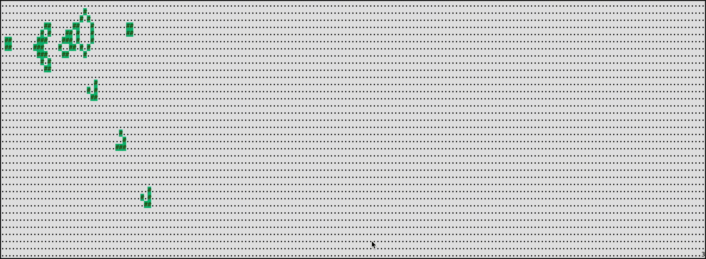

## Problem Description

This Kata is about calculating the next generation of Conway's game of life, given any starting position. See http://en.wikipedia.org/wiki/Conway%27s_Game_of_Life for background.

You start with a two dimensional grid of cells, where each cell is either alive or dead. In this version of the problem, the grid is finite, and no life can exist off the edges. When calcuating the next generation of the grid, follow these rules:

   1. Any live cell with fewer than two live neighbours dies, as if caused by underpopulation.
   2. Any live cell with more than three live neighbours dies, as if by overcrowding.
   3. Any live cell with two or three live neighbours lives on to the next generation.
   4. Any dead cell with exactly three live neighbours becomes a live cell.

You should write a program that can accept an arbitrary grid of cells, and will output a similar grid showing the next generation.

Clues

The input starting position could be a text file that looks like this:

Generation 1:
```
4 8
........
....*...
...**...
........
```

And the output could look like this:

Generation 2:
```
4 8
........
...**...
...**...
........
```

Source: http://www.codingdojo.org/cgi-bin/index.pl?KataGameOfLife


## Implemented with Curses gem

I implemented my game of life algorithm visually with the help of Curses Gem

in order to run it visually

```bash
bundle install

# some examples, see https://en.wikipedia.org/wiki/Conway%27s_Game_of_Life#Examples_of_patterns
bundle exec ruby life.rb glider # start with a 'glider'
bundle exec ruby life.rb blinker # start with a 'blinker'
bundle exec ruby life.rb block # start with a 'block'
bundle exec ruby life.rb beacon # start with a 'beacon'
bundle exec ruby life.rb combination # start with a 'combination'
bundle exec ruby life.rb pulsar # start with a 'pulsar'
bundle exec ruby life.rb gosper_gun # start with a 'gosper_gun'
```


### demo

**Gosper Gilder Gun**


**Random**

